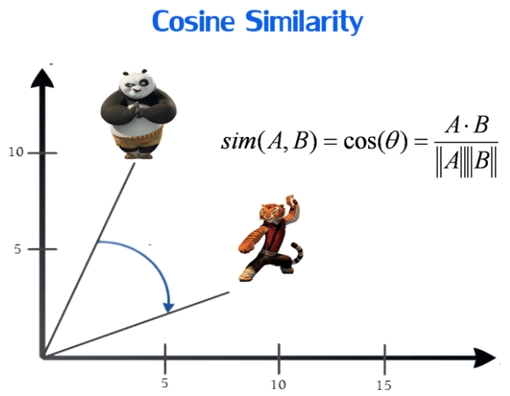

# Movie Recommendation System


A recommendation system that uses content based filtering and weighted average to recommend similar movies to user.


## Dataset

Movies dataset taken from [here](https://www.kaggle.com/stefanoleone992/imdb-extensive-dataset) or just simply extract from data.zip file inside pre_process folder in this repository.
## Demo

Live at: https://rb.gy/cwhrmp


## API Key Creation
* Go to https://www.themoviedb.org/ and create an account.
* Click on the API link from the left hand sidebar in your account settings.
* Fill all the required details to apply for API key.(In website URL, just write "None" if you don't have one).
* Once your request is approved, API key will be available in your API sidebar.
## Approach

Steps:
* **Data Collection**: Data was collected from the Kaggle.
* **Feature Engineering**: Using Jupyter Notebook,data is pre-processed and useful features are extracted.
* **Machine Learning**: Using NLP and concepts like content based filtering, cosine similarity and weighted average we create a recommendation engine.
* **Output**: Using Django we created an interface, so user has option to select movie and then get recommendation with respect to it and which will be displayed in the front end.

Concepts used:

* **Content Based Recommender**: It is also referred as cognitive filtering, here items are recommended based on a comparison between the content of the items and a user profile. For e.g: Let's say if user `A` likes movies: m1(Action), m2(Thriller) and m3(Action) and there is a user `B`, which also likes m1 and m2 movies, then  user `B` will also get recommendation of m3.
* **Cosine Similarity**:
    * It is a metric used to measure how similar two items are irrespective of their size. Mathematically, it measures the cosine of the angle between two vectors projected in a multi-dimensional space. The output value ranges from 0–1. *0 means no similarity, where as 1 means that both the items are 100% similar.*
    * Cosine similarity is advantageous because even if the two similar documents are far apart by the Euclidean distance (due to the size of the document), chances are they may still be oriented closer together. The smaller the angle, higher the cosine similarity.




    
## Installation

* Clone this repository in your local machine.

* Then, first install all dependencies:

```
    pip install -r requirements.txt
```
* Replace `YOUR_API_KEY` at line 195 in file movies/views.py


    
## To Run

Inside your terminal/command prompt from your project directory, run the Django project,

```
    python manage.py runserver.
```

Go to your browser and type http://127.0.0.1:8000/ in the address bar.